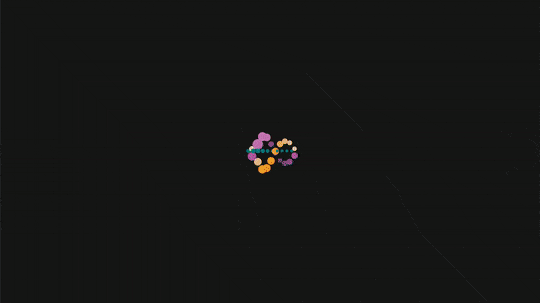

# Luke Charles
Portfolio site - rebuilt in React.

This is the latest iteration of my portfolio, I have rebuilt the current design using React.
The next part of this iteration is to introduce a database and GraphQL so I can move the data out of the React components.

This project was bootstrapped with [Create React App](https://github.com/facebook/create-react-app).
